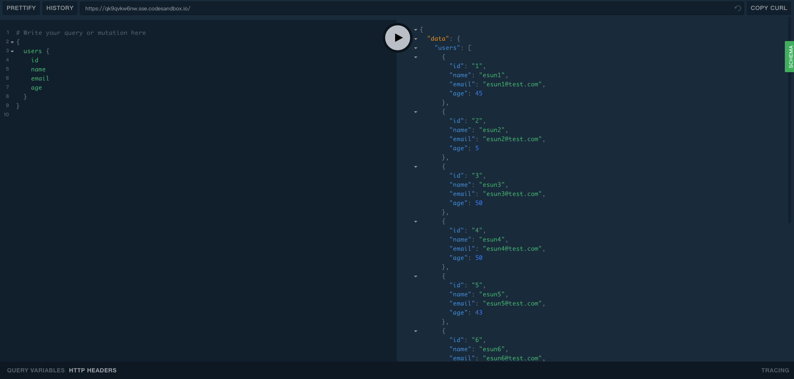
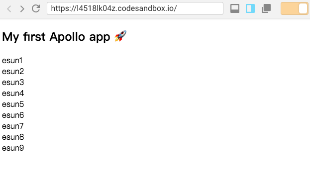

# apollo hooks 开发一个脚手架

​ 不久前，react 在 v16.7.0-alpha 版本中推出了新的 hooks 函数，其作用就是让你可以在 class 以外使用 state 和其他 react 特性。大家都知道，class 的写法有的时候很繁琐，比如其中的 this 问题等等。

​ 通过使用 useState，useEffect，useRef 等内置 hooks，封装更复杂的自定义 hooks。

​ 本项目将介绍在 appllo-client 中使用 hooks 做一个简单的客户端脚手架。[graphql-apollo-hooks-starter](https://github.com/eshun/graphql-apollo-hooks-starter)

​ 已在 CodeSandbox 创建的 demo [graphql-apollo-hooks-starter](https://codesandbox.io/s/github/eshun/graphql-apollo-hooks-starter)

## 创建项目

你可以通过 npm init、使用[create-react-app](https://github.com/facebook/create-react-app)或[CodeSandbox](https://codesandbox.io/dashboard/recent)在线创建一个 react 项目

```
graphql-apollo-hooks-starter
├── README.md
├── node_modules
├── package.json
├── .gitignore
├── public
│   ├── index.html
└── src
    ├── index.css
    ├── index.js
```

## 安装所需的架包

```
npm install apollo-boost react-apollo graphql react-apollo-hooks --save
```

- `apollo-boost`: 是一种零配置开始使用 Apollo Client 的方式
- `react-apollo`: 是 Apollo 数据栈在 React 呈现的基础架包
- `graphql`: 解析您的 GraphQL 查询
- `react-apollo-hooks`: 使用 Apollo Client 作为 React Hooks

## 设定 Apollo client

```
// src/index.js
import ApolloClient from "apollo-boost";

const client = new ApolloClient({
  uri: "https://qk9qvkw6nw.sse.codesandbox.io/"
});
```

> 为了能正确的启动客户端需要提前创建 GraphQL Server，在未设置 uri 的情况下客户端默认链接的是同该项目 Host 地址`/graphql`端点。
>
> 为了方便我这边在 codesandbox 创建了一个[Apollo Server demo](https://codesandbox.io/s/qk9qvkw6nw)方便测试（注意：如果出现 Network error: Failed to fetch，请先访问 server 确保服务是启动的，可以通过浏览器直接访问并测试：[https://qk9qvkw6nw.sse.codesandbox.io/](https://qk9qvkw6nw.sse.codesandbox.io/)）
>
> 

- `ApolloClient` 作为查询结果数据的中心存储，缓存并分发查询结果。

## 将您的客户端连接到 React

```
// src/index.js
import { ApolloProvider } from "react-apollo";

const App = () => (
  <ApolloProvider client={client}>
    <div>
      <h2>My first Apollo app 🚀</h2>
    </div>
  </ApolloProvider>
);
```

> ApolloProvider 默认情况下，Apollo 客户端会创建自己的内部 Redux store 来管理查询及其结果。

- `ApolloProvider` 使该客户端实例可用于多层的 React 组件中。

到这里我们先来个未使用 hooks，在调整到 hooks。

## 创建一个`pages/Users.js`组件

> 我们通过创建一个`pages/Users.js`组件来展示 Query 结果。

```
//index.js
import { ApolloProvider } from "react-apollo";

import Users from ".pages/Users";

function App() {
  return (
    <ApolloProvider client={client}>
      <div className="App">
        <h2>My first Apollo app 🚀</h2>
        <Users />
      </div>
    </ApolloProvider>
  );
}
```

```
//page/Users.js
import React from "react";
import { gql } from "apollo-boost";
import { Query } from "react-apollo";

import "../styles.css";

const getUsersQuery = gql`
  {
    users {
      id
      name
      email
      age
    }
  }
`;

// 未使用hooks
const Users = () => (
  <Query query={getUsersQuery}>
    {({ loading, error, data }) => {
      if (loading) return <p>Loading...</p>;
      if (error) return <p>Error :(</p>;

      return (
        <div>
          <ul style={{ "list-style-type": "none" }}>
            {data.users.map(currentUser => (
              <li key={currentUser.id}> {currentUser.name} </li>
            ))}
          </ul>
        </div>
      );
    }}
  </Query>
);
export default Users;

```

- `gql` 模板标签是你在 Apollo 客户端应用中定义 GraphQL 查询的方法。[更多信息](https://www.apollographql.com/docs/resources/graphql-glossary.html#gql-function)
- `Query` 组件是是 Apollo 中最重要的一个组成部分。Qurey 组件中的 variables 是为了向 query 中传递参数。[更多信息](https://www.apollographql.com/docs/react/essentials/queries.html)

查看结果



## 调整至 Hooks

```
//index.js
import { ApolloProvider } from "react-apollo"; // 使用hooks情况下也可以省略
import { ApolloProvider as ApolloHooksProvider } from "react-apollo-hooks";

import Users from ".pages/Users";

function App() {
  return (
    <ApolloProvider client={client}>
      <ApolloHooksProvider client={client}>
        <div className="App">
          <h2>My first Apollo app 🚀</h2>
          <Suspense fallback={<div>Suspense loading...</div>}>
            <Users />
          </Suspense>
        </div>
      </ApolloHooksProvider>
    </ApolloProvider>
  );
}
```

> Suspense 的作用可以理解为：render 函数->发现有异步请求->悬停，等待异步请求结果->再渲染展示数据

```
import React from "react";
import { gql } from "apollo-boost";
import { Query } from "react-apollo";
import { useQuery } from "react-apollo-hooks";

import "../styles.css";

const getUsersQuery = gql`
  {
    users {
      id
      name
      email
      age
    }
  }
`;

// 未使用hooks
const Users = () => (
  <Query query={getUsersQuery}>
    {({ loading, error, data }) => {
      if (loading) return <div>Loading...</div>;
      if (error) return `Users Error! ${error.message}`;

      return (
        <div>
          <ul className="ul">
            {data.users.map(currentUser => (
              <li key={currentUser.id}> {currentUser.name} </li>
            ))}
          </ul>
        </div>
      );
    }}
  </Query>
);

// 使用hooks，useQuery函数
const useUsers = () => {
  const { data, error, loading } = useQuery(getUsersQuery, { suspend: true });

  // 可以将useQuery与React Suspense一起使用{suspend：true}。由index.js Suspense达到组件异步请求等待效果
  // if (loading) return <div>Loading...</div>;
  if (error) return `Users Error! ${error.message}`;

  return (
    <div>
      <ul className="ul">
        {data.users &&
          data.users.map(user => <li key={user.id}> {user.name} </li>)}
      </ul>
    </div>
  );
};
export default useUsers;

```

> apollo hooks useQuery 要与 React Suspense 一起使用需要配置 suspend：true。
>
> 通过使用 hooks 后的代码更清晰，更容易阅读。

最后查看下结果


